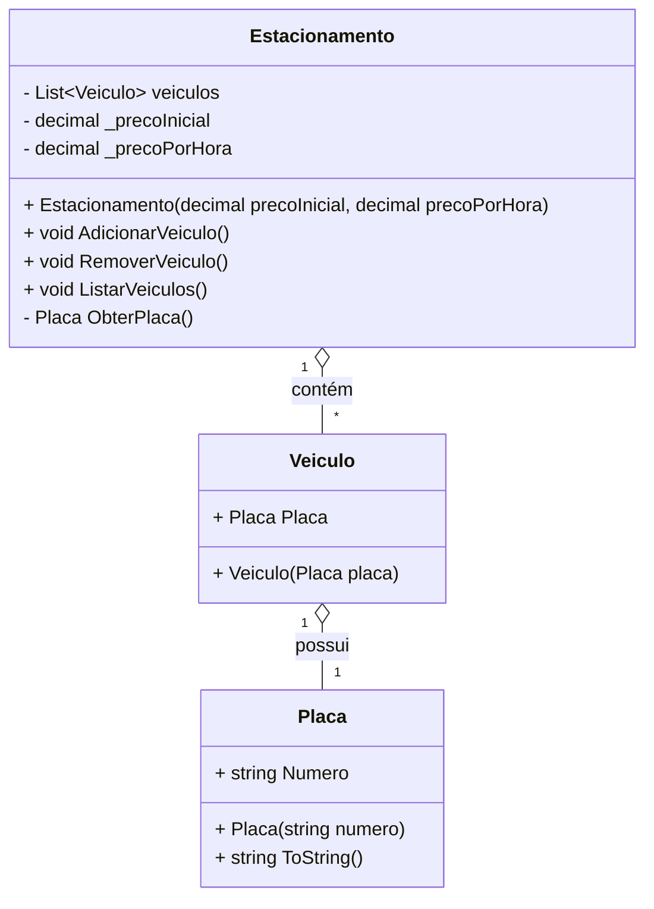

# Sistema de Estacionamento (console)

> Projeto de exemplo em .NET para gerenciar veículos estacionados via console.

## Origem do projeto

Este repositório contém uma solução para o desafio proposto na trilha de .NET (Fundamentos) da plataforma Digital Innovation One (DIO).
A proposta original do desafio pode ser consultada em:

https://github.com/digitalinnovationone/trilha-net-fundamentos-desafio/blob/main/README.md

Este README descreve a implementação própria deste repositório — não copia textualmente o enunciado original, apenas referencia a fonte e resume o propósito.

## Visão geral

`SistemaEstacionamento` é uma aplicação console simples em C# que permite:

- Adicionar veículos ao estacionamento pela placa.
- Remover veículos informando a placa e a quantidade de horas estacionadas (cálculo de cobrança).
- Listar veículos atualmente estacionados.

O objetivo é demonstrar modelagem básica (modelos `Placa`, `Veiculo`, `Estacionamento`), validação simples e interação via entrada/saída no console.

## Estrutura do projeto

- `Estacionamento/Models/Placa.cs` — representa a placa do veículo. Valida que o número tenha exatamente 7 caracteres e normaliza para maiúsculas.
- `Estacionamento/Models/Veiculo.cs` — modelo simples que contém uma `Placa`.
- `Estacionamento/Models/Estacionamento.cs` — lógica principal: gerencia a lista de veículos, adiciona, remove e lista; também calcula o valor a pagar ao remover um veículo.
- `Estacionamento/Program.cs` — ponto de entrada (console) que interage com o usuário.

## Diagrama de classes (Mermaid)

Abaixo está o diagrama de classes simplificado em Mermaid que representa as principais entidades do projeto.



## Funcionalidades e comportamento

- Adicionar veículo: solicita a placa, instancia um `Placa` e um `Veiculo`, e adiciona à lista interna.
- Remover veículo: solicita a placa, verifica se o veículo existe; se existir, solicita as horas estacionadas, calcula o valor total com base no preço inicial e preço por hora, remove o veículo e exibe o total.
- Listar veículos: exibe todas as placas dos veículos atualmente estacionados; se não houver veículos, informa que o estacionamento está vazio.

Observações de implementação:

- A placa é representada por um `record` (`Placa`) que lança uma exceção se o comprimento da string não for 7.
- Não há persistência: os dados ficam apenas em memória enquanto a aplicação roda.
- A interface é via console; não há verificação avançada de formato da placa além do comprimento.

## Requisitos

- .NET SDK (recomendado: versão definida em `global.json` do repositório).

## Como executar (Windows / PowerShell)

Abra um terminal na raiz do repositório e rode:

```powershell
dotnet run --project .\Estacionamento\Estacionamento.csproj
```

Em seguida, siga as instruções no console para adicionar, listar ou remover veículos.

## Exemplos de uso

- Adicionar: digite a placa quando solicitado (ex: `ABC1234`).
- Remover: informe a placa e depois a quantidade de horas (inteiro). O valor exibido será: preço inicial + preço por hora * horas.

## Possíveis melhorias

- Validar formato de placa (regex) além do comprimento.
- Persistir os dados (arquivo JSON, banco de dados leve, etc.).
- Admitir gerenciamento de vagas e horários de entrada/saída com registro datado.
- Adicionar testes automatizados para as regras de negócio.

## Licença

Projeto de exemplo — sinta-se livre para estudar e adaptar para fins educacionais.
